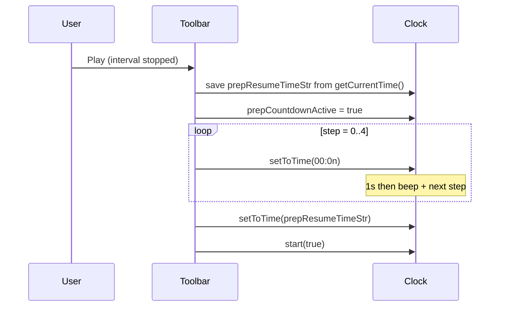

# Prep countdown — how it works (analysis)

This document describes the **5-second prep** behavior in `flipClock.js` as of the analysis date. Automated checks live in **`scripts/test-prep-countdown.mjs`** (`npm run test:prep`, requires **`npm run dev`**).

## Purpose

When the user presses **Play** while the main interval is stopped, the app does **not** start the round timer immediately. It runs a **prep phase**: the flip face shows **`00:05` → `00:01`**, then restores the **saved round time** and calls **`start(true)`** so the main countdown runs.

**Audio / animation:** After each **`setToTime`**, prep listens for **`animationend`** whose name **contains** **`flip-turn-down`** (last phase of the stacked flip), then **double `requestAnimationFrame`** before **`playPrepCountdownBeep()`** and the next **`runStep()`**. A **fallback** timer (**`FLIPCLOCK_PREP_FLIP_MS + 400`**) covers reduced-motion or environments without events. The toolbar **`FlipClock`** uses **`tickDuration: 1050`** so the **main** round **`doTick`** does not fire **`removeClass("play")`** while a **~1000 ms** flip is still running. E2E: **`prepAdvanceMs` 1400** per step and **`flushDoubleRaf()`** after **`page.clock.fastForward`** — Playwright’s fake clock advances **`setTimeout`** but not **`requestAnimationFrame`** in one shot.

## State and data

| Piece | Role |
|--------|------|
| `clock.prepCountdownActive` | `true` from prep start until cancel or handoff to `start(true)`. |
| `prepResumeTimeStr` (closure in `initFlipClockToolbar`) | **`MM:SS`** snapshot from **`comparableIntToMmSsString(clock.getCurrentTime())`** taken **once** when prep **begins** (the paused round time). |
| `prepTimeoutId` | After each **`setToTime`**, fallback **`setTimeout(..., FLIPCLOCK_PREP_FLIP_MS + 400)`** if **`animationend`** never fires; normal path uses **`animationend`** + debounced **double rAF** → **`prepChainDone()`** (beep + **`runStep()`**). |

## Timeline (ideal)

`beginPrepCountdown()` calls **`cancelPrepCountdown()`** first (no-op if not in prep), then saves **`prepResumeTimeStr`**, sets **`prepCountdownActive = true`**, and runs **`runStep()`** synchronously.

Each **`runStep()`**:

1. If `step >= 5` → **`finishPrepAndStartTimer()`**: clear timers, clear `prepCountdownActive`, **`setToTime(resume)`**, **`start(true)`**, **Start** sound, **toolbar refresh**.
2. Else: **`n = 5 - step`**, **`setToTime(prepStepToMmSs(n))`** → `00:05` … `00:01`, increment `step`, **`setTimeout`**: **`playPrepCountdownBeep()`** then **`runStep()`** after **`FLIPCLOCK_PREP_FLIP_MS`**.

So there are **five** visible prep frames (**`00:05`** through **`00:01`**), then on the **sixth** invocation **`step === 5`** completes prep **without** showing **`00:00`**. Total elapsed from first prep frame to **`start(true)`** is **5 seconds** (five × **1000 ms** waits).

## Sequence (mermaid)

## Interactions with other features

### Idle wall clock (`initFlipClockIdleWallClock`)

When the main timer is **stopped** and prep is **not** active, after **`FLIPCLOCK_IDLE_WALL_CLOCK_MS`** (10 s) the face can switch to **local `HH:MM`**. **`isCountdownInactive()`** requires **`prepCountdownActive !== true`**, so **during prep** the idle wall clock **does not** treat the clock as “inactive” for that purpose, and the toolbar refresh callback **`scheduleIdleWallClockSync()`** bails out while prep or the main tick is active.

### Chrome dimming

**`clockIsActiveForChromeDim()`** is true when **`tickInterval`** is set **or** **`prepCountdownActive`** — prep counts as “running” for dimming the toolbar / active preset.

### Cancel paths

- **Pause** during prep → **`cancelPrepCountdown()`** → restore **`prepResumeTimeStr`**, **Pause** sound.
- **Reset** → cancel prep, **stop**, **`setToTime(startTime)`**.
- **Apply preset** / **Clear active preset** → **`clock.cancelPrepCountdown()`** then usual preset logic.

## Risks / notes

1. **`beginPrepCountdown()`** starts with **`cancelPrepCountdown()`** — if that were ever called in a state where **`prepResumeTimeStr`** leaked, behavior could be wrong; in practice only **`cancelPrepCountdown`** and **`finishPrepAndStartTimer`** clear it.
2. **`getCurrentTime()`** returns a **numeric** digest of digits (e.g. **`430`** for **`04:30`**); **`comparableIntToMmSsString`** pads to four digit pairs for **`MM:SS`** — keep in sync with face digit count.
3. **Playwright** tests use **`page.clock.install()` before `goto`** so **`setTimeout`** can be **`fastForward`**’d without waiting **5 s** real time.
